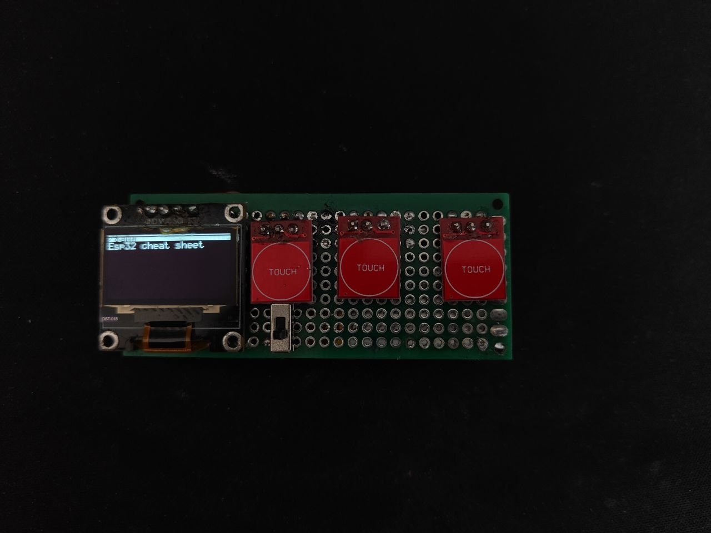
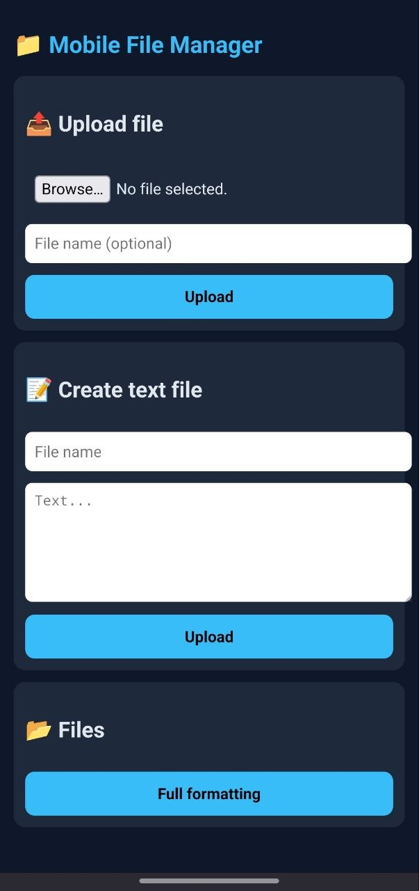

# ⚙️ESP32 Cheat sheet

## О проекте
ESP32 Cheat sheet - удобная и компактная шпаргалка, позволяющая легко списать на уроке

## ⚠️ Дисклеймер
Используйте на свой страх и риск. Я не несу ответсвенность за все спаливания

## Баги
    - Не правильное отображение заряда батареи
    - На веб сайте не удаляются файлы
    - После выхода из игры динозаврик есп может зависать, фиксится перезагрузкой

--- 

## ⚡ Возможности

 - Удобное управление с телефона с помощью веб сайта
 - Компактность
 - Бесшумные сенсорные кнопки
 - Хорошо читаемый русский/английский текст
 - Удобный скролл одной кнопкой
 - Возможность разбивать файлы на папки
 - Игра динозаврик для времяпрепровождения на скучных уроках

Веб страница

## 🛠️ Сборка

### Необходимые компоненты

| Компонент |
| Esp32-s3-superMini |
| Любой маленький аккумулятор |
| Tp4056 |
| Oled display SSD1306 |
| Сенсорная кнопка x3 |
| Тумблер питания |
| Шоттки диод |
| Резистор 10кОМ x2 |

### 🔌 Схема подключения

| Модуль | Пин | Пин | Пин | Пин | Пин | Пин | Пин |
|--------|-------|-------|-------|-------|-------|-------|-------|
| **🔋 Аккумулятор** | VCC → TP4056 bat + | GND → TP4056 bat - | - | - | - | - | - |
| **🔋 TP4056** | Out + → Switch center + | GND → Esp gnd - | Out + → Resistor 10kOM → G4 → Resistor 10kOM → ESP gnd | - | - | - | - |
| **Switch** | Right → Schottky diod → esp 3.3v | - | - | - | - | - | - |
| **📺 Дисплей** | VCC → 3V3 | GND → GND | SCL → G6 | SDA → G7 | - | - | - |
| **🔘 Кнопки** | Left → G12 | Right → G10 | OK → G11 | - | - | - | - |